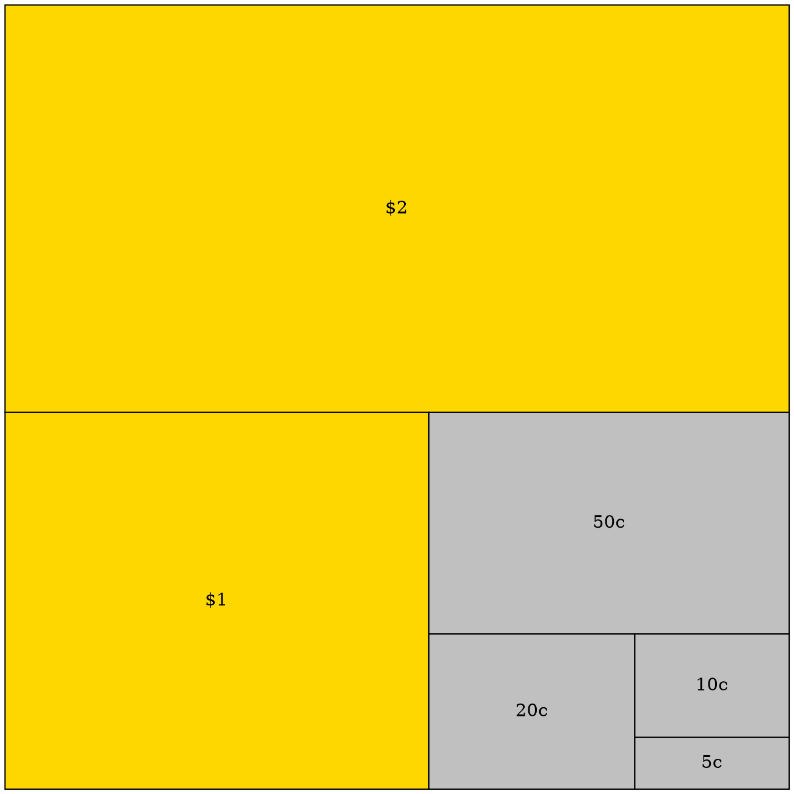

## rehype-plugin

```dot
digraph finite_state_machine {
    bgcolor="transparent";
    fontname="Helvetica,Arial,sans-serif";
    node [fontname="Helvetica,Arial,sans-serif"]
    edge [fontname="Helvetica,Arial,sans-serif"]
    rankdir=LR;
    node [shape = doublecircle]; 0 3 4 8;
    node [shape = circle];
    0 -> 2 [label = "SS(B)"];
    0 -> 1 [label = "SS(S)"];
    1 -> 3 [label = "S($end)"];
    2 -> 6 [label = "SS(b)"];
    2 -> 5 [label = "SS(a)"];
    2 -> 4 [label = "S(A)"];
    5 -> 7 [label = "S(b)"];
    5 -> 5 [label = "S(a)"];
    6 -> 6 [label = "S(b)"];
    6 -> 5 [label = "S(a)"];
    7 -> 8 [label = "S(b)"];
    7 -> 5 [label = "S(a)"];
    8 -> 6 [label = "S(b)"];
    8 -> 5 [label = "S(a)"];
}
```

```dot 
graph grid {
	bgcolor="transparent";
	label="grid"
	labelloc = "t"
	node [shape=plaintext]
	// arbitrary path on rigid grid
	A0 -- B1 -- C2 -- D3 -- E4 -- F5 -- G6 -- H7
	H0 -- G1 -- F2 -- E3 -- D4 -- C5 -- B6 -- A7

	edge [weight=1000 style=dashed color=dimgrey]

	// uncomment to hide the grid
	//edge [style=invis]

	A0 -- A1 -- A2 -- A3 -- A4 -- A5 -- A6 -- A7
	B0 -- B1 -- B2 -- B3 -- B4 -- B5 -- B6 -- B7
	C0 -- C1 -- C2 -- C3 -- C4 -- C5 -- C6 -- C7
	D0 -- D1 -- D2 -- D3 -- D4 -- D5 -- D6 -- D7
	E0 -- E1 -- E2 -- E3 -- E4 -- E5 -- E6 -- E7
	F0 -- F1 -- F2 -- F3 -- F4 -- F5 -- F6 -- F7
	G0 -- G1 -- G2 -- G3 -- G4 -- G5 -- G6 -- G7
	H0 -- H1 -- H2 -- H3 -- H4 -- H5 -- H6 -- H7

	rank=same {A0 -- B0 -- C0 -- D0 -- E0 -- F0 -- G0 -- H0}
	rank=same {A1 -- B1 -- C1 -- D1 -- E1 -- F1 -- G1 -- H1}
	rank=same {A2 -- B2 -- C2 -- D2 -- E2 -- F2 -- G2 -- H2}
	rank=same {A3 -- B3 -- C3 -- D3 -- E3 -- F3 -- G3 -- H3}
	rank=same {A4 -- B4 -- C4 -- D4 -- E4 -- F4 -- G4 -- H4}
	rank=same {A5 -- B5 -- C5 -- D5 -- E5 -- F5 -- G5 -- H5}
	rank=same {A6 -- B6 -- C6 -- D6 -- E6 -- F6 -- G6 -- H6}
	rank=same {A7 -- B7 -- C7 -- D7 -- E7 -- F7 -- G7 -- H7}
}
```

```dot
digraph {
  bgcolor="transparent";
  graph [rankdir=LR];
  node [shape=record];
  0 [label="0 | [&bull; S, $]\n[S &rarr; &bull; a S b, $]\n[S &rarr; &bull;, $]"];
  1 [label="1 | [S &bull;, $]"];
  2 [label="2 | [S &rarr; a &bull; S b, $]\n[S &rarr; &bull; a S b, b]\n[S &rarr; &bull;, b]"];
  3 [label="3 | [S &rarr; a S &bull; b, $]"];
  4 [label="4 | [S &rarr; a &bull; S b, b]\n[S &rarr; &bull; a S b, b]\n[S &rarr; &bull;, b]"];
  5 [label="5 | [S &rarr; a S b &bull;, $]"];
  6 [label="6 | [S &rarr; a S &bull; b, b]"];
  7 [label="7 | [S &rarr; a S b &bull;, b]"];
  0 -> 1 [label=S];
  0 -> 2 [label=a];
  2 -> 3 [label=S];
  2 -> 4 [label=a];
  3 -> 5 [label=b];
  4 -> 6 [label=S];
  4 -> 4 [label=a];
  6 -> 7 [label=b];
}
```



## astro-component

import { Graphviz } from "@beoe/astro-graphviz";

<Graphviz
  class="not-content"
  code={`digraph finite_state_machine {
    bgcolor="transparent";
    fontname="Helvetica,Arial,sans-serif";
    node [fontname="Helvetica,Arial,sans-serif"]
    edge [fontname="Helvetica,Arial,sans-serif"]
    rankdir=LR;
    node [shape = doublecircle]; 0 3 4 8;
    node [shape = circle];
    0 -> 2 [label = "SS(B)"];
    0 -> 1 [label = "SS(S)"];
    1 -> 3 [label = "S($end)"];
    2 -> 6 [label = "SS(b)"];
    2 -> 5 [label = "SS(a)"];
    2 -> 4 [label = "S(A)"];
    5 -> 7 [label = "S(b)"];
    5 -> 5 [label = "S(a)"];
    6 -> 6 [label = "S(b)"];
    6 -> 5 [label = "S(a)"];
    7 -> 8 [label = "S(b)"];
    7 -> 5 [label = "S(a)"];
    8 -> 6 [label = "S(b)"];
    8 -> 5 [label = "S(a)"];
}`}
/>
