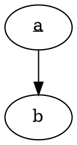
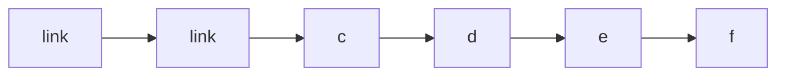
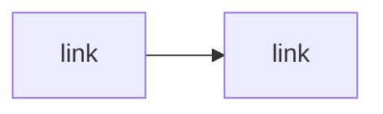

import { Tabs, TabItem } from "@astrojs/starlight/components";

Works only with `strategy=inline`.

## Searchable text

Search text in the diagram with <kbd>Cmd</kbd> + <kbd>F</kbd>.

**⚠️ Note**: text search doesn't work for Vizdom.

## Links

**📝 Note**: links in diagrams combine nicely with [link previews](https://astro-digital-garden.stereobooster.com/recipes/link-previews/).

### Graphviz

<Tabs>
  <TabItem label="Diagram">
```dot strategy=inline
digraph g {
  bgcolor="transparent";
  rankdir=LR;
  node [shape=rect];
  a -> b -> c -> d -> e -> f
  a[URL="https://example.com" label=<<u>link</u>>]
}
```
  </TabItem>
  <TabItem label="Markdown">
````md

````
  </TabItem>
</Tabs>

### Vizdom

<Tabs>
  <TabItem label="Diagram">
```vizdom strategy=inline
digraph g {
  rankdir=LR;
  node [shape=rect];
  a -> b -> c -> d -> e -> f
  a[URL="https://example.com" label=link]
}
```
  </TabItem>
  <TabItem label="Markdown">
````md
```vizdom strategy=inline
digraph g {
  a -> b
  a[URL="https://example.com" label=link];
}
```
````
  </TabItem>
</Tabs>

### Mermaid

<Tabs>
  <TabItem label="Diagram">
  


  </TabItem>
  <TabItem label="Markdown">

````md

````

  </TabItem>
</Tabs>

### D2

<Tabs>
  <TabItem label="Diagram">
  
```d2 strategy=inline darkScheme=false pad=20
direction: right
a -> b -> c -> d -> e
a {
  link: https://example.com
  label: link
}
```

  </TabItem>
  <TabItem label="Markdown">

````md
```d2 strategy=inline darkScheme=false pad=20
direction: right
a -> b -> c -> d -> e
a {
  link: https://example.com
  label: link
}
```
````

  </TabItem>
</Tabs>

**⚠️ Note**: dark mode doesn't work for `strategy=inline` for D2 due to CSS conflicts

## Progressive enhancement with JS

When SVG inlined one can use JS to add interactivity. For example,

```js
[...document.querySelectorAll(".node")].forEach((n) =>
  n.addEventListener("click", () => alert("Hello"))
);
```

Some diagrams may provide as well additional data, for example, Vizdom

```js
import { json } from "@dagrejs/graphlib";

document.querySelectorAll(".vizdom").forEach((container) => {
  const data = container.getAttribute("data-beoe")
    ? JSON.parse(container.getAttribute("data-beoe")!)
    : null;

  if (!data) return;
  const graph = json.read(data);
  // ...
})
```

Which allows to add interesting interactivity. See examples below.

### Vizdom Example 1

**Try** hower nodes.

<Tabs>
  <TabItem label="Diagram">
```vizdom strategy=inline dataGraph=dagre class=shadow
digraph g {
  rankdir=LR;
  node [shape=rect];
  a -> b -> c -> d -> e -> f
}
```
  </TabItem>
  <TabItem label="Markdown">
````md
```vizdom strategy=inline dataGraph=dagre class=shadow
digraph g {
  rankdir=LR;
  node [shape=rect];
  a -> b -> c -> d -> e -> f
}
```
````
  </TabItem>
  <TabItem label="JS">

```ts
import { json, alg, type Path } from "@dagrejs/graphlib";

type D = { [node: string]: Path };

document.querySelectorAll(".vizdom.shadow").forEach((container) => {
  const data = container.getAttribute("data-beoe")
    ? JSON.parse(container.getAttribute("data-beoe")!)
    : null;

  if (!data) return;
  const graph = json.read(data);

  function clear() {
    container
      .querySelectorAll(".node,.edge,.cluster")
      .forEach((node) => node.classList.remove("shadow"));
  }

  function highlight(id: string) {
    container
      .querySelectorAll(".node,.edge,.cluster")
      .forEach((node) => node.classList.add("shadow"));
    alg.postorder(graph, [id]).forEach((node) => {
      container.querySelector(`#node-${node}`)?.classList.remove("shadow");
      graph.outEdges(node)?.forEach(({ name }) => {
        container.querySelector(`#edge-${name}`)?.classList.remove("shadow");
      });
    });
  }

  // highlight on hover
  let currentHover: string | null = null;
  container.addEventListener("mouseover", (e) => {
    // @ts-expect-error
    const node = e.target?.closest(".node");

    if (node) {
      const id = node.getAttribute("id").replace("node-", "");
      if (currentHover == id) return;
      clear();
      highlight(id);
      currentHover = id;
    } else {
      if (currentHover == null) return;
      clear();
      currentHover = null;
    }
  });
});
```
  </TabItem>
  <TabItem label="CSS">

```css
.vizdom[data-beoe].shadow {
  .shadow {
    opacity: 0.4;
  }

  .node {
    cursor: default;
  }
}
```
  </TabItem>
</Tabs>

### Vizdom Example 2

**Try** hower and click one or two nodes.

<Tabs>
  <TabItem label="Diagram">
```vizdom strategy=inline dataGraph=dagre class=ants
digraph g {
  rankdir=LR;
  node [shape=rect];
  a -> b -> c -> d -> e -> f
}
```
  </TabItem>
  <TabItem label="Markdown">
````md
```vizdom strategy=inline dataGraph=dagre class=ants
digraph g {
  rankdir=LR;
  node [shape=rect];
  a -> b -> c -> d -> e -> f
}
```
````
  </TabItem>
  <TabItem label="JS">

```ts
import { json, alg, type Path } from "@dagrejs/graphlib";

type D = { [node: string]: Path };

document.querySelectorAll(".vizdom.ants").forEach((container) => {
  const data = container.getAttribute("data-beoe")
    ? JSON.parse(container.getAttribute("data-beoe")!)
    : null;

  if (!data) return;
  const graph = json.read(data);

  function clear() {
    container.querySelectorAll(".node").forEach((node) => {
      node.classList.remove("active");
      node.classList.remove("selected");
    });
    container
      .querySelectorAll(".edge")
      .forEach((node) => node.classList.remove("active"));
  }

  function highlight(id: string) {
    alg.postorder(graph, [id]).forEach((node) => {
      container.querySelector(`#node-${node}`)?.classList.add("active");
      graph.outEdges(node)?.forEach(({ name }) => {
        container.querySelector(`#edge-${name}`)?.classList.add("active");
      });
    });
  }

  function walkPath(d: D, node: string) {
    container.querySelector(`#node-${node}`)?.classList.add("active");
    if (d[node].distance === 0 || d[node].distance === Infinity) return;
    graph.outEdges(d[node].predecessor, node)?.forEach(({ name }) => {
      container.querySelector(`#edge-${name}`)?.classList.add("active");
    });
    walkPath(d, d[node].predecessor);
  }

  function drawShortestpath(a: string, b: string) {
    const first = alg.dijkstra(graph, a);
    if (first[b].distance != Infinity) {
      walkPath(first, b);
      return;
    }
    const second = alg.dijkstra(graph, b);
    if (second[a].distance != Infinity) {
      walkPath(second, a);
      return;
    }
  }

  let selected = new Set<string>();
  // highlight selected
  // if two nodes selected will show shortest path
  container.addEventListener("click", (e) => {
    // @ts-expect-error
    const node = e.target?.closest(".node");
    if (!node) return;
    const id = node.getAttribute("id").replace("node-", "");
    clear();

    if (selected.has(id)) {
      selected.delete(id);
    } else {
      if (selected.size < 2) {
        selected.add(id);
      } else {
        selected.delete([...selected][0]);
        selected.add(id);
      }
    }
    if (selected.size === 0) return;
    if (selected.size === 1) {
      const id = [...selected][0];
      container.querySelector(`#node-${id}`)?.classList.add("selected");
      highlight(id);
      return;
    }

    const [a, b] = [...selected];
    container.querySelector(`#node-${a}`)?.classList.add("selected");
    container.querySelector(`#node-${b}`)?.classList.add("selected");
    drawShortestpath(a, b);
  });

  // highlight on hover
  let currentHover: string | null = null;
  container.addEventListener("mouseover", (e) => {
    if (selected.size > 1) return;
    // @ts-expect-error
    const node = e.target?.closest(".node");
    if (selected.size === 0) {
      if (node) {
        const id = node.getAttribute("id").replace("node-", "");
        if (currentHover == id) return;
        clear();
        highlight(id);
        currentHover = id;
      } else {
        if (currentHover == null) return;
        clear();
        currentHover = null;
      }
    } else {
      const selectedId = [...selected][0];
      if (node) {
        const id = node.getAttribute("id").replace("node-", "");
        if (currentHover == id) return;
        clear();
        container
          .querySelector(`#node-${selectedId}`)
          ?.classList.add("selected");
        drawShortestpath(selectedId, id);
        currentHover = id;
      } else {
        if (currentHover == null) return;
        clear();
        container
          .querySelector(`#node-${selectedId}`)
          ?.classList.add("selected");
        highlight(selectedId);
        currentHover = null;
      }
    }
  });
});
```
  </TabItem>
  <TabItem label="CSS">

```css
@keyframes dash {
  from {
    stroke-dashoffset: 40;
  }
  to {
    stroke-dashoffset: 0;
  }
}
.vizdom[data-beoe].ants {
  .edge.active a path:first-child {
    stroke-dasharray: 5 5;
    animation-name: dash;
    animation-duration: 1000ms;
    stroke-dashoffset: 0;
    animation-iteration-count: infinite;
    animation-timing-function: linear;
  }

  .node.selected a *:first-child {
    stroke-width: 2px;
  }

  .node {
    cursor: pointer;
  }
}
@media (prefers-reduced-motion) {
  .vizdom[data-beoe].ants {
    .edge.active a path:first-child {
      animation-duration: 4000ms;
    }
  }
}
```
  </TabItem>
</Tabs>

### Notes

- JS and CSS for those examples are not included in Vizdom Rehype plugin, but feel free to copy (from this website) and modify them
- Graphviz Rehype plugin also provides option for `data` (`dataGraph=dagre`), but ids in SVG are consistent with ids in JSON. So it doesn't really work
- [Request to support JSON representation for D2](https://github.com/terrastruct/d2/discussions/2224)
