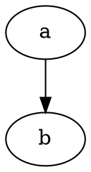

import { Tabs, TabItem } from "@astrojs/starlight/components";

Works only with `strategy=inline`.

**Basic idea**: you can target with CSS any SVG node, something like this:

```css
.some-diagram .node {
  /* styles */
}
```

**But there are more tricks**. If there are no classes that you can target, you can as well target attributes:

```css
.graphviz {
  text {
    fill: var(--sl-color-white);
  }
  [fill="black"],
  [fill="#000"] {
    fill: var(--sl-color-white);
  }
  [stroke="black"],
  [stroke="#000"] {
    stroke: var(--sl-color-white);
  }
}
```

Graphviz allows to expose HTML classes, that can be used for further styling:

<Tabs>
  <TabItem label="Diagram">
```dot strategy=inline
digraph g {
  bgcolor="transparent";
  rankdir=LR;
  node [shape=rect];
  a -> b -> c -> d -> e -> f
  a[class="style-me"]
}
```
  </TabItem>
  <TabItem label="Markdown">
````md

````
  </TabItem>
  <TabItem label="CSS">
```css
.graphviz .style-me path {
  fill: lightblue;
}
```
  </TabItem>
</Tabs>

**⚠️ Note**: this doesn't work for Vizdom.