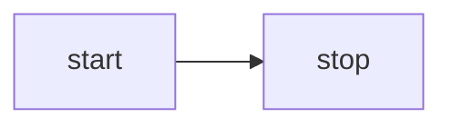

import { PackageManagers } from "starlight-package-managers";
import { Tabs, TabItem } from "@astrojs/starlight/components";

Rehype plugin to generate [Mermaid](https://mermaid.js.org/) diagrams in place of code fences. Example:

<Tabs>
  <TabItem label="Diagram">
  


  </TabItem>
  <TabItem label="Markdown">

````md

````

  </TabItem>
</Tabs>

## Installation

<PackageManagers pkg="@beoe/rehype-mermaid playwright" />

You may want also add this to `package.json`:

```json
"scripts": {
  "postinstall": "playwright install chromium"
}
```

## Usage

```js
import rehypeMermaid from "@beoe/rehype-mermaid";

const html = await unified()
  .use(remarkParse)
  .use(remarkRehype)
  .use(rehypeMermaid, {
    /* options */
  })
  .use(rehypeStringify)
  .process(`markdown`);
```

Check out other [options](/start-here/configuration/).

### Configuration

You probaly want to use [`file`](/start-here/strategy/#file) strategy and one of dark schemes (`class` or `media`). Unless you need [interactivity](/start-here/interactivity/).

## Note about `rehype-mermaid`

There is battle-tested and well maintained [rehype-mermaid](https://github.com/remcohaszing/rehype-mermaid). Both plugins use the same [mermaid-isomorphic](https://github.com/remcohaszing/mermaid-isomorphic) behind the scene.
