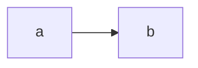

import { Tabs, TabItem } from "@astrojs/starlight/components";

## Alt

Works only with strategy [`file`](/start-here/strategy/#file) and [`data-url`](/start-here/strategy/#data-url)

<Tabs>
  <TabItem label="Markdown">
````md
```d2 strategy=file pad=20 alt="testing alt"
direction: right
a -> b -> c -> d -> e
```
````
  </TabItem>
  <TabItem label="Diagram">
```d2 strategy=file pad=20 alt="testing alt"
direction: right
a -> b -> c -> d -> e
```

  </TabItem>
  <TabItem label="Resulting HTML">
```html
...

...
```
  </TabItem>
</Tabs>

## Figcaption

[figcaption](https://developer.mozilla.org/en-US/docs/Web/HTML/Element/figcaption) can be implemented.

## Mermaid

Mermaid has special params for accessibility

<Tabs>
  <TabItem label="Markdown">
````md

````
  </TabItem>
  <TabItem label="HTML">

```xml
<svg>
  <desc>Bob's Burgers process for making big decisions</desc>
</svg>
```

  </TabItem>
  <TabItem label="Diagram">

  </TabItem>
</Tabs>
