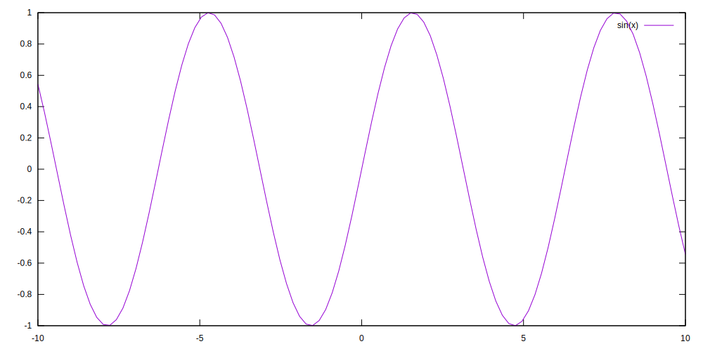

# @dat/rehype-gnuplot

Rehype plugin to generate [Gnuplot](https://gnuplot.sourceforge.net/) diagrams (as inline SVGs) in place of code fences. This:

````md
```gnuplot
plot [-10:10] sin(x)
```
````

will be converted to

```html
<div class="datt gnuplot">
  <svg>...</svg>
</div>
```

which looks like this:



## Usage

```js
import rehypeGnuplot from "@datt/rehype-gnuplot";

const html = await unified()
  .use(remarkParse)
  .use(remarkRehype)
  .use(rehypeGnuplot)
  .use(rehypeStringify)
  .process(`markdown`);
```

It support caching the same way as [@datt/rehype-code-hook](/packages/rehype-code-hook/) does.
