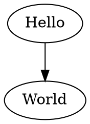

# @beoe/rehype-graphviz

Rehype plugin to generate [Graphviz](https://graphviz.org/) diagrams in place of code fences. This

````md

````

will be converted to

```html
<figure class="beoe graphviz">
  <svg>...</svg>
</figure>
```

which can look like this:

**TODO**: add screenshot

## Usage

```js
import rehypeGraphviz from "@beoe/rehype-graphviz";

const html = await unified()
  .use(remarkParse)
  .use(remarkRehype)
  .use(rehypeGraphviz)
  .use(rehypeStringify)
  .process(`markdown`);
```

[Online documentation](https://beoe.stereobooster.com/diagrams/graphviz/) provides more details.

## TODO

- expose options to load font metrics and images
  - `Warning: no hard-coded metrics for 'Helvetica,Arial,sans-serif'.  Falling back to 'Times' metrics`
- check `tred` and `unflatten` functions
  - https://hpcc-systems.github.io/hpcc-js-wasm/graphviz/src/graphviz/classes/Graphviz.html
