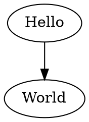

# @beoe/rehype-graphviz

Rehype plugin to generate [Graphviz](https://graphviz.org/) diagrams (as inline SVGs) in place of code fences. This

````md

````

will be converted to

```html
<figure class="beoe graphviz">
  <svg>...</svg>
</figure>
```

which can look like this:

**TODO**: add screenshot

## Usage

```js
import rehypeGraphviz from "@beoe/rehype-graphviz";

const html = await unified()
  .use(remarkParse)
  .use(remarkRehype)
  .use(rehypeGraphviz)
  .use(rehypeStringify)
  .process(`markdown`);
```

It support caching the same way as [@beoe/rehype-code-hook](/packages/rehype-code-hook/) does.

## Tips

### Styling and dark mode

You can add dark mode with something like this:

```css
:root {
  --color-variable: #000;
}
@media (prefers-color-scheme: dark) {
  :root {
    --color-variable: #fff;
  }
}
.graphviz {
  text {
    fill: var(--color-variable);
  }
  [fill="black"] {
    fill: var(--color-variable);
  }
  [stroke="black"] {
    stroke: var(--color-variable);
  }
}
```

Plus you can pass [class](https://graphviz.org/docs/attrs/class/) to Edges and Nodes to implement advanced styling.

### Transparent background

To remove background use:

```dot
digraph G {
 bgcolor="transparent"
}
```

### To remove title

To remove `title` (which shows as tooltip when you hover mouse) use:

```dot
digraph G {
 node[tooltip=" "]
}
```

### You can add links

Inline SVG can contain HTML links:

```dot
digraph G {
 node[URL="https://example.com"]
}
```

## TODO

- expose options to load font metrics and images
  - `Warning: no hard-coded metrics for 'Helvetica,Arial,sans-serif'.  Falling back to 'Times' metrics`
- check `tred` and `unflatten` functions
  - https://hpcc-systems.github.io/hpcc-js-wasm/graphviz/src/graphviz/classes/Graphviz.html
