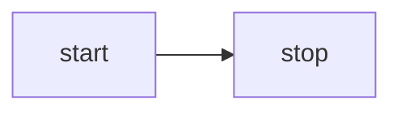

# @beoe/rehype-mermaid

Rehype plugin to generate [Mermaid](https://mermaid.js.org/) diagrams in place of code fences. This:

````md

````

will be converted to

```html
<figure class="beoe mermaid">
  <svg>...</svg>
</figure>
```

which can look like this:


## Usage

```js
import rehypeMermaid from "@beoe/rehype-mermaid";

const html = await unified()
  .use(remarkParse)
  .use(remarkRehype)
  .use(rehypeMermaid)
  .use(rehypeStringify)
  .process(`markdown`);
```

[Online documentation](https://beoe.stereobooster.com/diagrams/mermaid/) provides more details.
