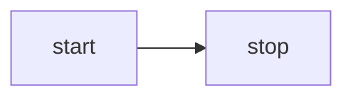

# @beoe/rehype-mermaid

Rehype plugin to generate [Mermaid](https://mermaid.js.org/) diagrams (as inline SVGs) in place of code fences. This:

````md

````

will be converted to

```html
<figure class="beoe mermaid">
  <svg>...</svg>
</figure>
```

which can look like this:


## How is it different from `rehype-mermaid`?

There is battle-tested and well maintained [rehype-mermaid](https://github.com/remcohaszing/rehype-mermaid). Both plugins use the same [mermaid-isomorphic](https://github.com/remcohaszing/mermaid-isomorphic) behind the scene.

Main **difference** is that this plugin supports cache, but less teted. Also it supports only "inline-svg" strategy - rehype-mermaid's default strategy.

## Usage

```js
import rehypeMermaid from "@beoe/rehype-mermaid";

const html = await unified()
  .use(remarkParse)
  .use(remarkRehype)
  .use(rehypeMermaid)
  .use(rehypeStringify)
  .process(`markdown`);
```

It support caching the same way as [@beoe/rehype-code-hook](/packages/rehype-code-hook/) does.

## TODO

- maybe use `waitFor`
- maybe remove `style="max-width: ..."`
- test `mermaid-isomorphic` options (`css, mermaidConfig, prefix, browser, launchOptions`)
- write tips about styling with CSS
