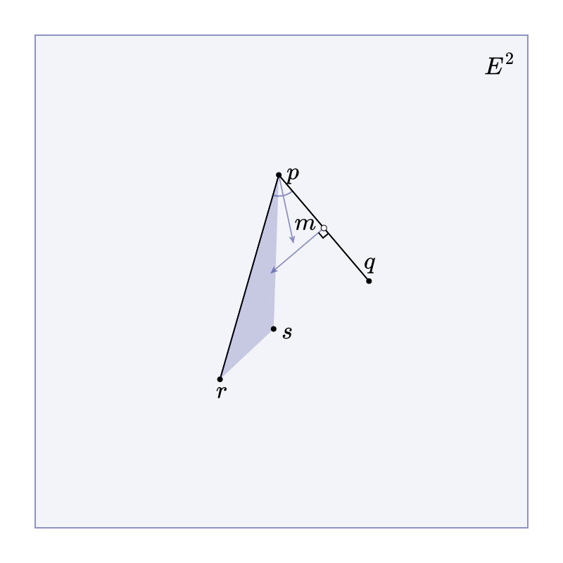

# @beoe/rehype-penrose

Rehype plugin to generate [penrose](https://penrose.cs.cmu.edu/) diagrams in place of code fences. This

````md
```penrose style="euclidean.style" domain="euclidean.domain" width=800 height=800
Plane P
Point p, q, r, s
In(p, P)
In(q, P)
In(r, P)
In(s, P)
Let a := Segment(p, q)
Let b := Segment(p, r)
Point m := Midpoint(a)
In(m, P)
Angle theta := InteriorAngle(q, p, r)
Let t := Triangle(p, r, s)
Ray w := Bisector(theta)
Segment h := PerpendicularBisector(a, m)
AutoLabel p, q, r, s, m
Label P $E^2$
```
````

will be converted to

```html
<figure class="beoe penrose">
  <svg>...</svg>
</figure>
```

which looks like this:



**Note**:

You need to add **domain** and **style** files to `shared` folder, for example:

- [`euclidean.domain`](./test/shared/euclidean.domain)
- [`euclidean.style`](./test/shared/euclidean.style)

## Usage

```js
import rehypePenrose from "@beoe/rehype-penrose";

const html = await unified()
  .use(remarkParse)
  .use(remarkRehype)
  .use(rehypePenrose, { shared: "shared" })
  .use(rehypeStringify)
  .process(`markdown`);
```

[Online documentation](https://beoe.stereobooster.com/diagrams/penrose/) provides more details.

## TODO

- [ ] fix SVGO issue
