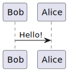

# @beoe/rehype-plantuml

Rehype plugin to generate [plantuml](https://www.plantuml.com/) diagrams (as inline SVGs) in place of code fences. This:

````md
```plantuml
Bob->Alice : Hello!
```
````

will be converted to

```html
<figure class="beoe plantuml">
  <svg>...</svg>
</figure>
```

which can look like this:



## PlantUML installation options

There are several ways how to run PlantUML

- with public server e.g. `https://www.plantuml.com/plantuml/svg/`
  - for example, see [remark-simple-plantuml](https://github.com/akebifiky/remark-simple-plantuml)
- with docker
- install PlantUML locally e.g. install Java, Graphviz and download copy of `plantuml.jar`

I don't like any of those options, but for now settled down with the **last one**.

## Usage

You need to install Java and Graphviz in order to use this plugin.

```js
import rehypePlantuml from "@beoe/rehype-plantuml";

const html = await unified()
  .use(remarkParse)
  .use(remarkRehype)
  .use(rehypePlantuml)
  .use(rehypeStringify)
  .process(`markdown`);
```

It support caching the same way as [@beoe/rehype-code-hook](/packages/rehype-code-hook/) does.
