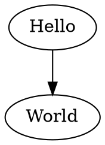

# @beoe/rehype-vizdom

> [!WARNING]
> Doesn't work because `@vizdom/vizdom-ts-esm` uses [WebAssembly/ES Module Integration](https://github.com/WebAssembly/esm-integration/tree/main/proposals/esm-integration) proposal, which is not supported by [Vite](https://github.com/vitejs/vite/discussions/7763) and the plugin [doesn't seem to work with Vitest](https://github.com/Menci/vite-plugin-wasm/issues/56#issuecomment-2253169420)

Rehype plugin to generate [Vizdom](https://github.com/vizdom-dev/vizdom) diagrams (as inline SVGs) in place of code fences. This

````md

````

will be converted to

```html
<figure class="beoe vizdom">
  <svg>...</svg>
</figure>
```

which can look like this:

**TODO**: add screenshot

## Usage

```js
import rehypeGraphviz from "@beoe/rehype-vizdom";

const html = await unified()
  .use(remarkParse)
  .use(remarkRehype)
  .use(rehypeGraphviz)
  .use(rehypeStringify)
  .process(`markdown`);
```

It support caching the same way as [@beoe/rehype-code-hook](/packages/rehype-code-hook/) does.

## Tips

### Styling and dark mode

You can add dark mode with something like this:

```css
:root {
  --color-variable: #000;
}
@media (prefers-color-scheme: dark) {
  :root {
    --color-variable: #fff;
  }
}
.vizdom {
  text {
    fill: var(--color-variable);
  }
  [fill="black"] {
    fill: var(--color-variable);
  }
  [stroke="black"] {
    stroke: var(--color-variable);
  }
}
```

Plus you can pass [class](https://vizdom.org/docs/attrs/class/) to Edges and Nodes to implement advanced styling.

### Transparent background

To remove background use:

```dot
digraph G {
 bgcolor="transparent"
}
```

### To remove title

To remove `title` (which shows as tooltip when you hover mouse) use:

```dot
digraph G {
 node[tooltip=" "]
}
```

### You can add links

Inline SVG can contain HTML links:

```dot
digraph G {
 node[URL="https://example.com"]
}
```

## TODO
